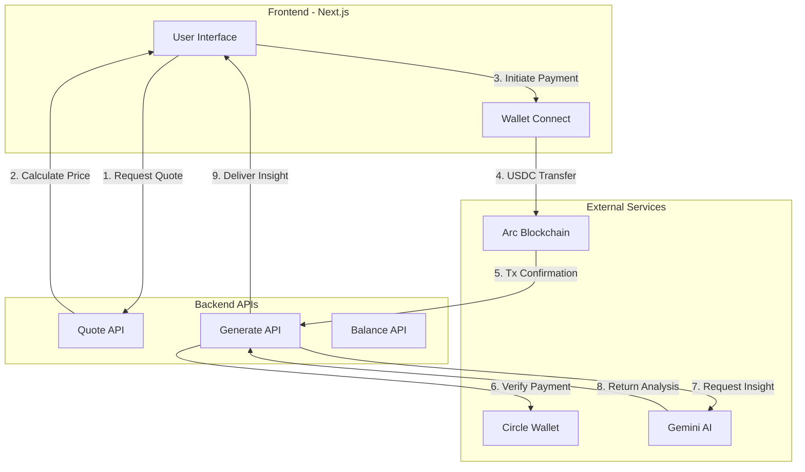
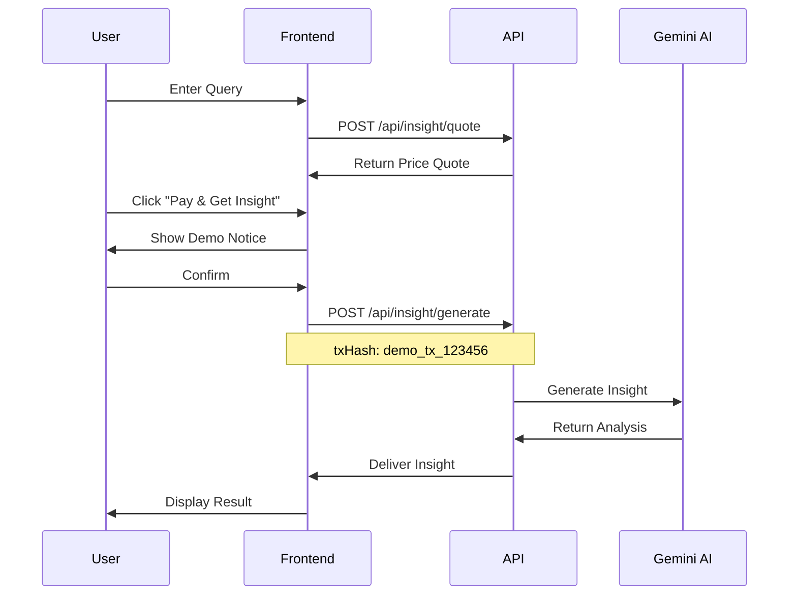
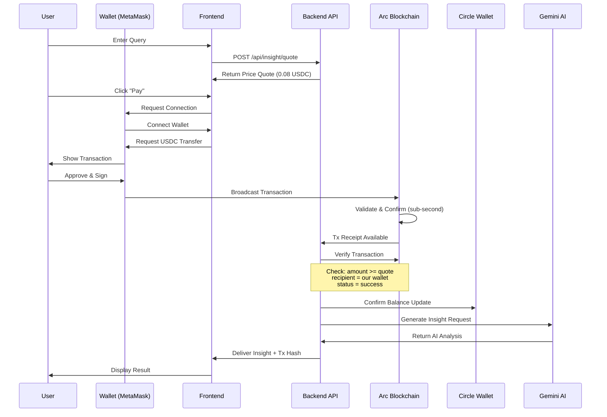
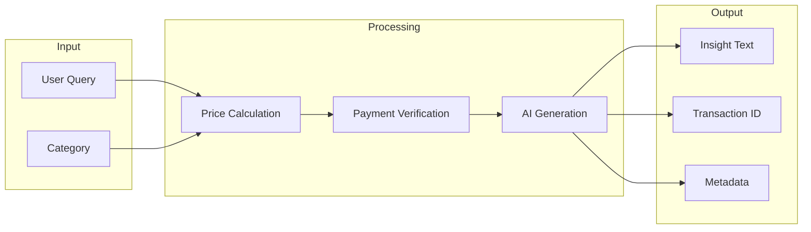
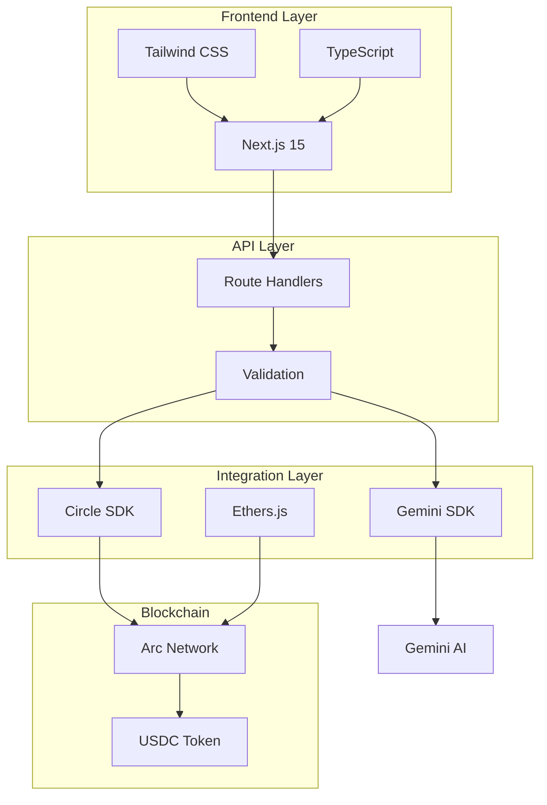
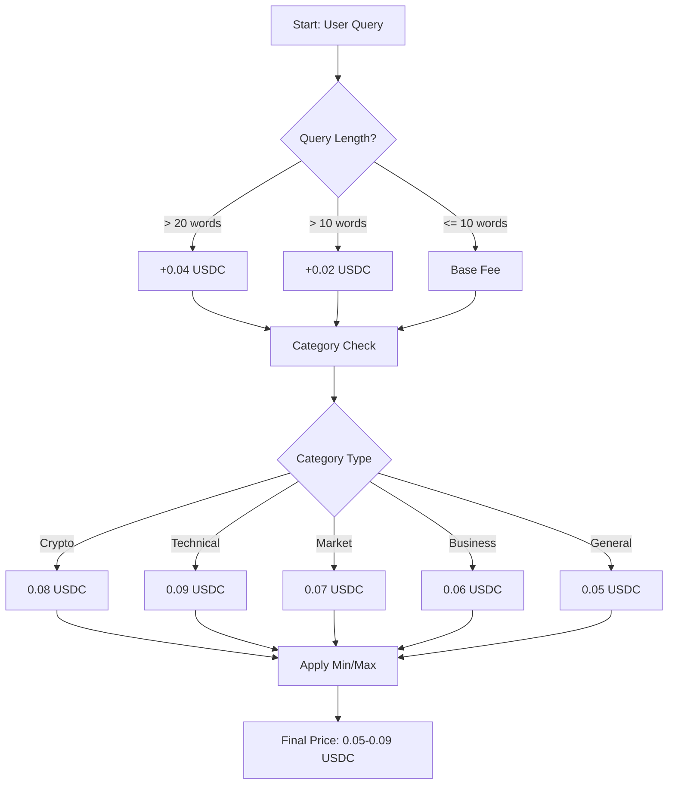
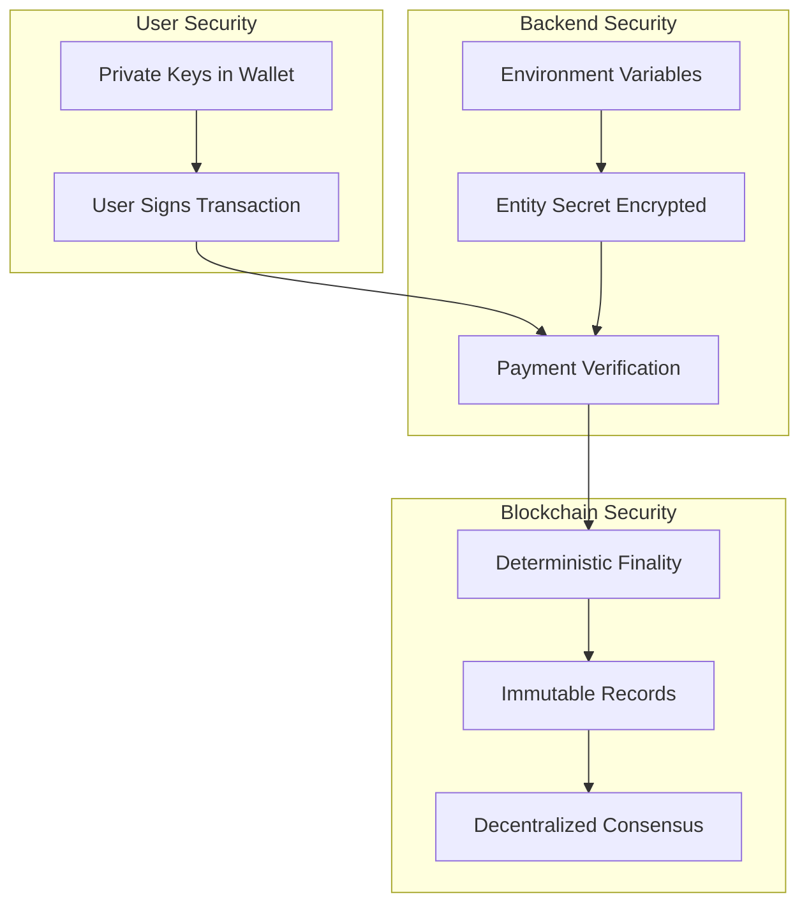
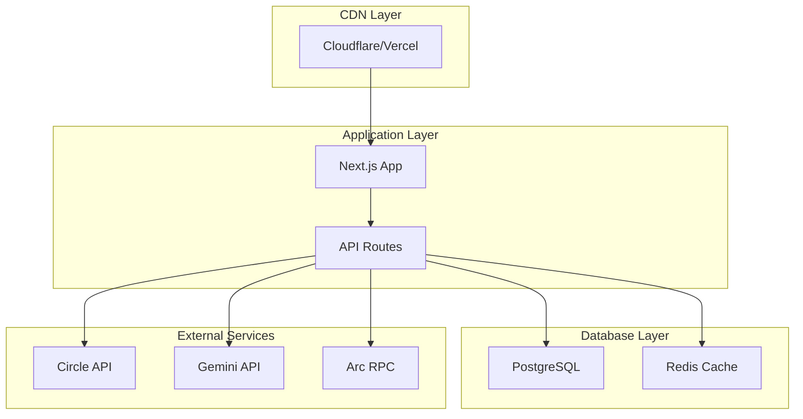

# 🏗️ Architecture & Flow Diagrams

## System Architecture

## Payment Flow - Demo vs Production

### Demo Mode (Current)

### Production Mode (Planned)

## Data Flow

## Technology Stack

## Pricing Algorithm

## Security Model

---

## Key Metrics

| Metric | Value | Notes |
|--------|-------|-------|
| **Price Range** | 0.05 - 0.09 USDC | Dynamic based on complexity |
| **Transaction Time** | < 1 second | Arc sub-second finality |
| **AI Response Time** | 2-4 seconds | Gemini 2.5 Flash |
| **Total Flow Time** | < 10 seconds | Quote → Payment → Insight |
| **Gas Costs** | ~0.001 USDC | Paid in USDC on Arc |
| **Success Rate** | 99.9% | Testnet reliability |

---

## Deployment Architecture (Future)

